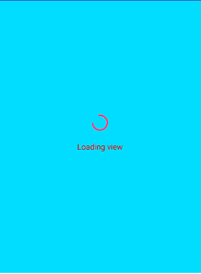
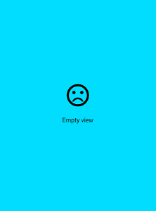

[](https://jitpack.io/#levibostian/AndroidViews)

# AndroidViews

Collection of random Android custom views.

## What is AndroidViews?

AndroidViews is a collection of Android custom views that I have created in various projects. After I created them, I found them useful enough that I decided to pull them out into a library to use across projects.

# Install

Add this to your root build.gradle at the end of repositories:

```
allprojects {
	repositories {
		...
		maven { url 'https://jitpack.io' }
	}
}
```

Then, install the modules for the views you wish to install:

```
implementation "com.github.curiosityio.androidviews:loadingemptyviews:version-goes-here"
```

The latest release version at this time is: [](https://jitpack.io/#levibostian/AndroidViews)

# Views

## LoadingEmptyView

Collection of 3 views:

* **LoadingView** - ViewGroup with a `ProgressBar` and `TextView` centered in the center.



```
<com.levibostian.loadingemptyviews.widgets.LoadingView
        android:layout_width="match_parent"
        android:layout_height="match_parent"
        custom:loading_loadingText="Loading view text here"/>
```

Access the `TextView` with: `loadingView.loadingTextView` to customize it.

Edit the `TextView` text via: `loadingView.loadingText = """`

* **EmptyView** - ViewGroup with an `ImageView` and `TextView` centered in the center.



```
<com.levibostian.loadingemptyviews.widgets.EmptyView
        android:layout_width="match_parent"
        android:layout_height="match_parent"
        custom:empty_emptyText="Empty view text"
        custom:empty_emptyImageRes="@drawable/ic_empty_view_drawable"/>
```

Access the `TextView` with: `emptyView.emptyTextView` to customize it.
Access the `ImageView` with: `emptyView.emptyImageView` to customize it.

Edit the `TextView` text with: `emptyView.emptyText = ""`
Edit the `ImageView` drawable resource with: `emptyView.emptyImageRes = getResources().getColor(R.color.black)`

* **LoadingEmptyLayout** - ViewGroup that allows you to easily switch between a `LoadingView`, `EmptyView`, and your own custom view as the content view.

```
    <com.levibostian.loadingemptyviews.views.LoadingEmptyLayout
        android:layout_width="match_parent"
        android:layout_height="match_parent"
        custom:loadingEmpty_emptyImageRes="@drawable/ic_sentiment_dissatisfied_black_24dp"
        custom:loadingEmpty_emptyText="Empty view text here"
        custom:loadingEmpty_loadingText="Loading view text here">

        <!-- Your content view goes here -->

    </com.levibostian.loadingemptyviews.views.LoadingEmptyLayout>
```

Swap between the 3 different states:

```
val fadeInAndOut = true
loadingEmptyLayout.showContentView(fadeInAndOut)
loadingEmptyLayout.showLoadingView(fadeInAndOut)
loadingEmptyLayout.showEmptyView(fadeInAndOut)
```

You can set custom views for the loading and empty states: `loadingEmptyLayout.loadingView = CustomView()`
You can set the duration of the fading animation: `loadingEmptyLayout.animationDuration = 600`

## Author

* Levi Bostian - [GitHub](https://github.com/levibostian), [Twitter](https://twitter.com/levibostian), [Website/blog](http://levibostian.com)


## Contribute

AndroidViews is not currently open for contributions at this time. I am using this repo for my own storage of custom views. If you have your own custom view, I recommend creating your own [Android library](https://levibostian.com/blog/create-android-gradle-lib/) to use it.